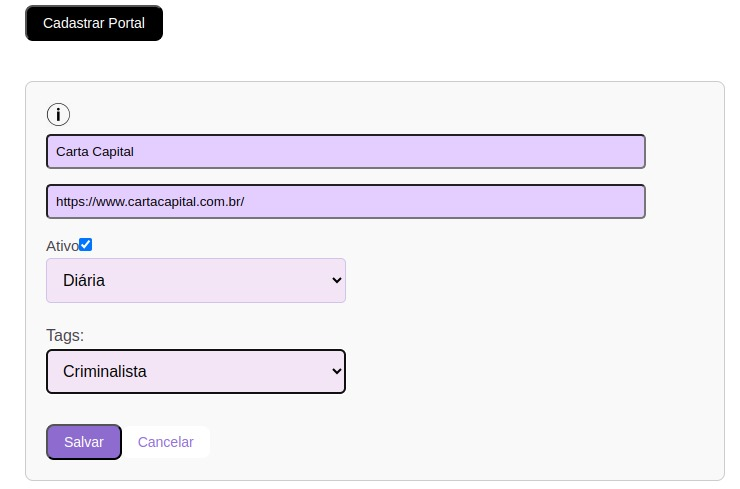

# Manual do Usuário - Cérberus

## Introdução

O *Cérberus* é uma ferramenta desenvolvida para realizar a captura e armazenamento de notícias estratégicas e dados associados, utilizando portais de notícias e APIs. Ele permite a consulta de notícias filtradas por diferentes critérios, como palavras-chave, jornalistas, portais e datas de publicação. O sistema também realiza a captura automática de informações via *scraping* de notícias e APIs registradas.

---

## Funcionalidades Disponíveis

### 1. Cadastro de APIs

O sistema permite o cadastro de APIs que fornecem dados estratégicos. Ao cadastrar uma API, o usuário pode:

- Definir o *nome da API*.
- Informar a *URL* da API.
- Marcar se a API está *ativa*.
- Definir o *período de captura* (diariamente, semanalmente, etc).

### 2. Cadastro de Portais

Além das APIs, o sistema permite cadastrar portais de notícias de onde os dados serão coletados via *scraping*. O usuário pode:

- Definir o *nome do portal*.
- Inserir a *URL do portal*.
- Associar *tags* ao portal (ex.: agricultura, tecnologia).

### 3. Cadastro de Tags

O usuário também pode cadastrar *tags* que ajudarão a categorizar e filtrar as notícias. No cadastro de tags, é possível:

- Definir o *nome da tag*.
- Adicionar uma *descrição* da tag.
- Associar *tags relacionadas* (ex.: soja, milho, exportação).

### 4. Consulta de Notícias

O *Cérberus* oferece uma tela de consulta para buscar notícias já capturadas. Os dados são obtidos por meio de *scraping* e armazenados no banco de dados, onde podem ser filtrados pelos seguintes critérios:

- *Palavras-chave*.
- *Data de publicação*.
- *Portal de origem*.
- *Jornalista*.
- *Tags associadas*.

## Processos de Uso

### Cadastro de APIs

1. Navegue até a aba APIs.
2. Clique em Cadastrar nova API.
3. Preencha o nome da API e a URL.
4. Marque a opção ativa, se necessário.
5. Escolha o período de captura (diariamente, semanalmente, etc).
6. Clique em Salvar.

### Cadastro de Portais

1. Acesse a aba Portais.
2. Clique em Cadastrar novo Portal.
3. Preencha o nome do portal e a URL.
4. Selecione as tags associadas ao portal.
5. Clique em Salvar.

### Cadastro de Tags

1. Vá para a aba Tags.
2. Clique em Cadastrar nova Tag.
3. Insira o nome da tag e a descrição.
4. Selecione as tags relacionadas.
5. Clique em Salvar.

### Consulta de Notícias

1. Acesse a aba Notícias.
2. Use o campo de palavras-chave para inserir termos de pesquisa.
3. Defina o período de busca usando as datas de início e fim.
4. Utilize os filtros de portal, **jornalista e tags para refinar a pesquisa.
5. Clique em Buscar para visualizar as notícias capturadas.

---

## Observações Finais

- O sistema utiliza scraping para capturar dados de portais de notícias e APIs. Certifique-se de que os portais cadastrados estão ativos e disponíveis para captura.
- Todas as entidades (APIs, Portais, Tags) podem ser editadas ou excluídas diretamente pela interface do sistema.
- As capturas de notícias ocorrem de acordo com o período de captura definido no cadastro de cada API ou portal.